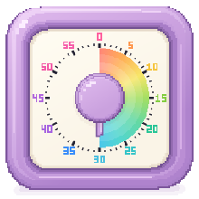

# VibeClock 🌈

Навайбкодила с утра, чтобы учить польский по таймеру.
Теперь procrastynacja тоже по расписанию.

Маленький пиксельный таймер на 60 минут для Windows 10/11. Радуга исчезает, польский — hopefully появляется.

**[Скачать VibeClock.exe](https://github.com/yulia-maier/VibeClock/releases/latest/download/VibeClock.exe)** — без установки и дополнительного .NET.

- Потяни ручку — выбери время.
- Клик по ручке — пауза, правый клик — сброс.
- Потяни корпус — перемести окно.
- Правый клик вне ручки — звук, автозапуск и «поверх всех окон».

C# · WPF · .NET 10. [Сборка и устройство проекта](docs/DEVELOPMENT.md).
